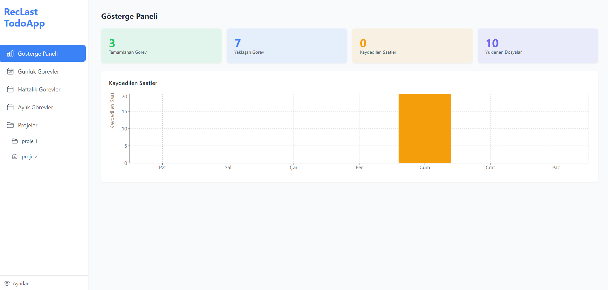
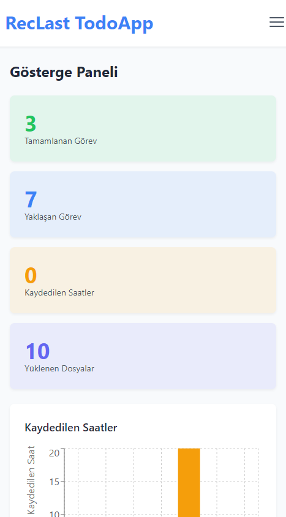

# 📌 RecLast Todo App

A powerful and modern Todo App built with React, designed to help you manage tasks efficiently. Whether it's daily, weekly, monthly, or project-based tasks, our app provides a structured way to stay productive.

## 🚀 Features

✅ **Dashboard System** – Get a quick overview of your tasks and projects.
✅ **Task Management** – Add tasks on a daily, weekly, monthly, or project basis.
✅ **Project Management** – Create and manage projects with ease.
✅ **Priority System** – Set task priorities to focus on what matters most.
✅ **Modern UI/UX** – A clean, intuitive, and modern design.
✅ **Responsive Design** – Fully functional across all screen sizes.
✅ **Settings & Customization** – Personalize the app according to your preferences.
✅ **Multi-language Support** – Use the app in different languages.
✅ **Task Export & Import** – Download your tasks and reload them when needed.
✅ **All-in-One Solution** – Everything you need in a single, well-organized application.

## 📸 Screenshots

- Fulll APP

- Responsive Mobile


## 🛠️ Installation & Setup

Follow these simple steps to install and run the project locally.

### Prerequisites

Make sure you have the following installed on your system:
- [Node.js](https://nodejs.org/) (v14+ recommended)
- [Git](https://git-scm.com/)

### Clone the Repository
```sh
git clone https://github.com/RecLast/ReactTodoAPP-RecLast
cd ReactTodoAPP-RecLast
```

### Install Dependencies
```sh
npm install
```

### Start the Application
```sh
npm start
```

The app will now be available at `http://localhost:3000`.

## ⚙️ Configuration

You can customize the application settings via the settings menu. Supported customizations include:
- **Language Selection**
- **Theme Preferences**
- **Notification Preferences**

## 📦 Deployment

To deploy the app, you can use:

### Build for Production
```sh
npm run build
```

This command generates optimized production files in the `build/` folder.

### Deploying to Vercel
```sh
npm install -g vercel
vercel
```

## 🏗️ Technologies Used

- **React.js** – Frontend framework
- **Redux** – State management
- **Tailwind CSS** – Modern styling
- **React Router** – Navigation handling
- **i18next** – Multi-language support

## 🎯 Future Improvements

🔹 Integration with third-party calendar apps
🔹 Dark mode support
🔹 Team collaboration features
🔹 Task reminders and notifications

## 📜 License

This project is licensed under the MIT License - see the [LICENSE](LICENSE) file for details.

## 🤝 Contributing

We welcome contributions! Feel free to open issues and pull requests to improve the project.

## 📞 Contact

For any inquiries, reach out via:
- **Email**: iletisim@umiteski.com.tr
- **GitHub Issues**: [Open an issue]([https://github.com/yourusername/todo-app/issues](https://github.com/RecLast/ReactTodoAPP-RecLast/issues))

Happy Coding! 🚀

